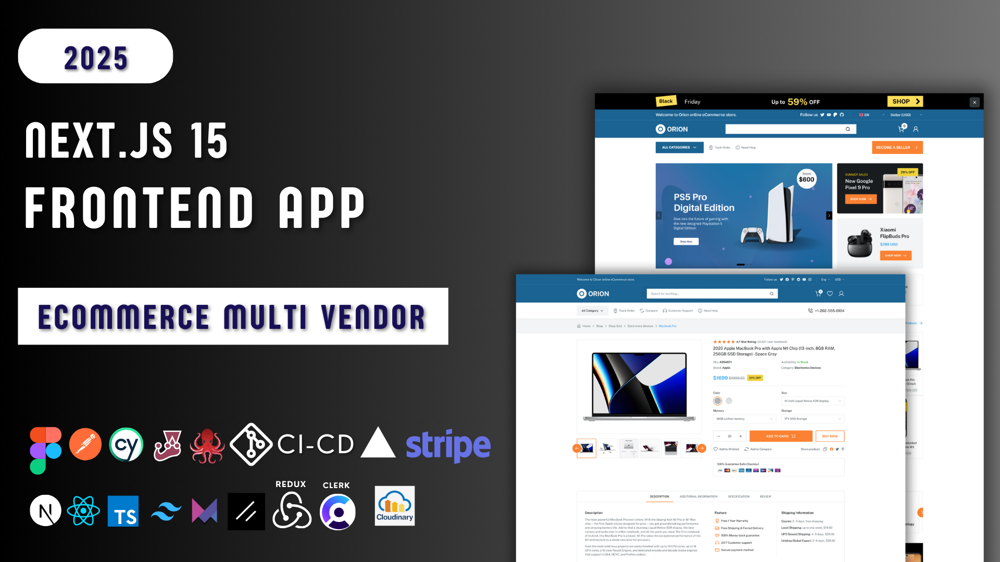

<h1 align="center">
  <a  href="https://orion-store-prod.vercel.app" target="_blank">Store</a>
  
  <a  href="https://orion-api-five.vercel.app/">Admin</a>
</h1>

 

  
  
  
  

  

# Learn Frontend development with Nextjs - Full Course.

## ✔️ Introduction

You are willing to learn Frontend Developement with Nextjs, this is a complete course that might help you improve your frontend skills and increase your employability.

Watch, learn, do research, Try to  build your own project and DO NOT GIVE UP.
 

## 📂 Features 

ORION multi-vendor marketplace platform is standalone e-commerce software with SASS Integrated. It allows you to build et deploy your multi vendor marketplaces.

It's well documented and customzable, as a developer you can extend its features to fill your needs.

On the marketplace, multiple vendors market and sell their products through a single storefront. ORION multi vendor software supports an unlimited number of sellers on one marketplace. It's a perfect solution for online retail sales.

✔️ Ready-to-use Numerous Seller/Vendor Features

- Intuitive Seller Dashboard

- Unlimited Products Upload

- Unlimited Vendor Accounts

- Vendor Orders

- Vendor Shipments

- Vendor subscribe to premium

✔️Full Marketplace Control & Manage by Admin

- Approve/disapprove, Edit/Delete Vendor/seller Stores

- Manage categories

- Manage subcategories

- Manage sellers subscription

- Manage brands

- Manage collections

- Manage tags

- Manage sellers Stores

- Manage sellers withdrawals

 

## ❓ Who this course is for ?

- Beginners in JavaScript

- Frontend Developers

- Web developers

- Passionate learners 

 

## 📅 Project Structure

- Admin part :  Building scalable Frontend Admin for the online store

- Store part: Building scalable Front-end store with friendly UI

 

## 📅 Code organization and folder structure

The project contains all Next.js App Router pages and layouts, and takes care of the routing.

## 🎯 What skills you will learn 

- Learning how to integrate a full figma design from scratch using Tailwind Css and NextJs

- Learning Responsive design using Tailwind Css and NextJs

- Learning how to structure your Front-end application with NextJs

- Learning how to create reusable components with React and NextJs

- Learning how to integrate Restful APIs

- Integrating client side validation with Zod Validator

- Integrating a state management tool like Redux Toolkit

- Learning NextJs Optimizations such as Server Side Rendering (SSR) , Static Side Generation (SSG) , Client Side Rendering (CSR), Incremental Static Regeneration (ISR)

- Learning Nextjs SEO Concepts and practices.

- Testing your application with Cypress and Jest.

 

## ❌ If you have issues: 

Get the source code and solve problems at your own.

your can do research using [ChatGPT](https://chatgpt.com/).

you can send me a message [Here](https://www.patreon.com/messages?mode=campaign&tab=chats).

 

## ✅ Prerequisite knowledge

This course assumes knowledge of HTML, CSS, JavaScript.
 

## ✅ System requirements

Before you start this course, make sure you have the following installed:

Node.js 20.x or later installed.

Operating systems: macOS, Windows (including WSL), or Linux.

VSCode or another text editor of your choice.

 

## ASSETS

🟢Online Store Website ORION MULTI VENDOR

- Store Website : [Orion Store](https://orion-store-prod.vercel.app)

- Figma Store Front : [Figma](https://www.figma.com/design/izslJAyRNNXZrlpoVAOCbK/Orion---eCommerce-Marketplace)

🔴Admin - Seller Dashboard ORION MULTI VENDOR

- Dashboard Admin - Seller : [Admin-Sellers](https://orion-api-five.vercel.app/)

- API documentation link: [API Docs](https://app.swaggerhub.com/apis-docs/SYLVAINCODEUR/Nextjs/1.0.0#/)
 

